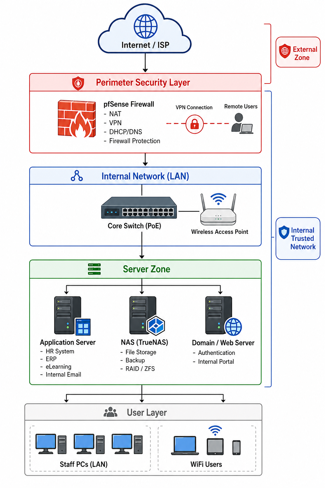
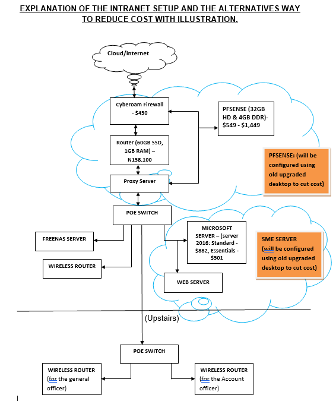
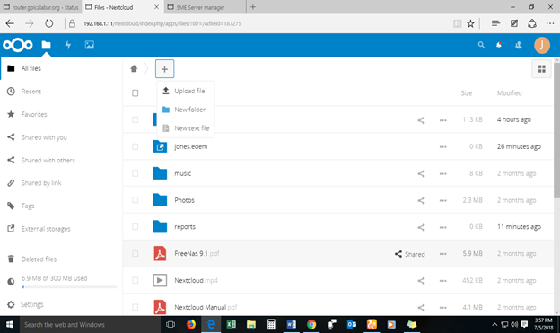
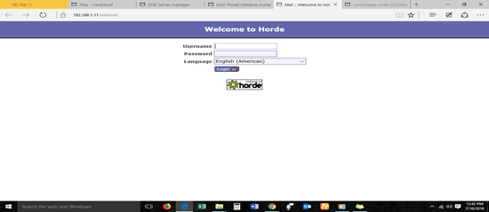
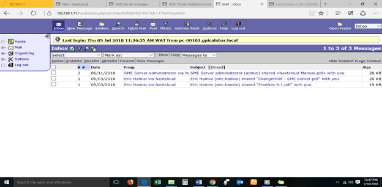
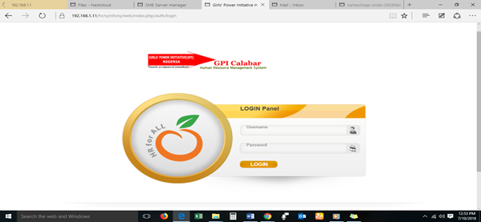
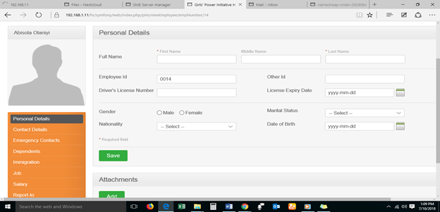

# # Low-Cost Secure Intranet & IT Infrastructure (GPI Calabar – 2017/2018)

**A real-world case study of designing and implementing a secure, scalable IT infrastructure for a non-profit organization using open-source tools and repurposed hardware.**

---

## 📌 Project Overview

In 2017, I served as **ICT Officer** at **Girls’ Power Initiative (GPI), Calabar**, under the supervision of **Eric Hamisi (CUSO International ICT Advisor)**.

The initial assignment was to support basic ICT improvements. However, the project evolved into a **full-scale infrastructure transformation**, delivering a secure intranet, internal cloud systems, and enterprise-style applications.

---

## 🎯 Objectives

- Build a secure internal network (wired + wireless)
- Implement centralized storage and backup systems
- Enable internal communication without internet dependency
- Digitize organizational processes (HR, records, learning)
- Reduce infrastructure cost using open-source solutions

---

## 🚀 What Was Delivered

- 🌐 Official Website: https://gpicalabar.org  
- 🖧 Full Intranet (LAN + WiFi)
- ☁️ Internal Cloud Storage & File Sharing System  
- 🗄️ NAS with redundancy (data protection)  
- 👥 HR Management System  
- 📊 ERP components  
- 🎓 eLearning Platform  
- 📧 Internal Email System (offline capable)  
- 📑 SLA Draft with ISP  
- 📘 User Manual + Staff Training  
- 📚 Virtual Library System  

---

## 🏗️ Architecture & Technologies

## 🏗️ Architecture Evolution

### Initial Design

### Improved Design (AI-Assisted Visualization)

### Cost Optimization Model

---

### 🔐 Core Infrastructure

- **Firewall/Router**: pfSense  
  - Firewall, VPN, DHCP, DNS, traffic shaping  

- **Application Server**: SME Server / NethServer  
  - Domain controller, mail server, web apps  

- **Storage Server**: FreeNAS (TrueNAS CORE)  
  - ZFS, RAID/mirroring, centralized storage  

- **Network Hardware**: PoE Switch  
  - Supports future IP phones, CCTV, APs  

---

## 💰 Cost Optimization

- Used refurbished systems instead of new servers  
- Eliminated proprietary licenses  
- Built entirely on open-source stack  

💡 **Estimated savings: ₦1,337,000+**

---

## 🔐 Security Implementation

- Firewall protection (pfSense)
- Network segmentation
- Access-controlled file systems
- Data redundancy (RAID/mirroring)
- Internal-only communication systems
- Backup and recovery design

---

## 🛠️ Real Implementation (Field Work)

### Network Setup & Deployment

This shows the physical implementation of the infrastructure, including cable crimping, network setup, and server deployment using repurposed hardware.

---

## 💻 Systems Implemented

### 📚 Library Management System

---

### ☁️ Local Cloud Backup System

---

### 📧 Internal Email System

**Login Page**

**Inbox**

---

### 👥 HR Management System

**Login Page**

**Dashboard / Update Page**

---

## 📊 Impact

- Improved internal communication
- Centralized and secure data storage
- Reduced operational cost significantly
- Enabled digital transformation
- Prepared organization for scalability

---

## 🧠 Lessons Learned

### Challenges:
- Funding delays  
- Hardware sourcing limitations  
- Time constraints  
- User adoption resistance  

### Key Insights:
- Open-source tools can deliver enterprise-grade systems  
- Security must be built into architecture  
- Training is critical for adoption  

---

## 🔄 Modern Upgrade Path (2026)

For organizations replicating this today:

- Firewall → pfSense / OPNsense  
- Virtualization → Proxmox VE  
- File Sharing → Nextcloud  
- HR → ERPNext / OrangeHRM  
- Storage → TrueNAS  

---

## 📁 Repository Structure

- `docs/` → Security Design, Implementation Guide, Modern Implementation Guide, Lessons Learned, User Manual generic
- `images/` → Architecture diagrams  
- `manual/` → User documentation  

---

## 👤 Attribution

**Implemented by:** Jones Edem  
**Supervisor:** Eric Hamisi (CUSO International)  
**Organization:** Girls’ Power Initiative (GPI), Calabar  
**Year:** 2017/2018  

---

## 🤝 Open for Use

This project is open for adaptation by NGOs and small organizations.

If you replicate or improve this setup:
- Fork the repo  
- Share your version  
- Contribute improvements  

---

## 🔐 Data Protection Notice

Sensitive internal documents, configurations, and user data have been excluded from this repository to comply with organizational data protection policies and security best practices.

---

## 💡 Final Note

This project demonstrates that **secure, scalable IT systems can be built even in low-resource environments** with the right design and technical approach.
